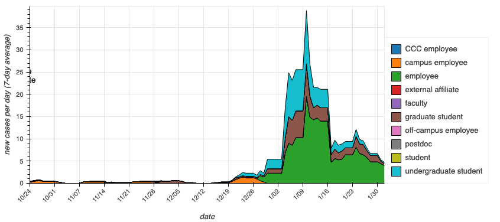
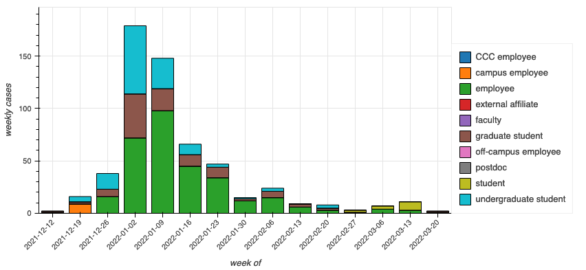
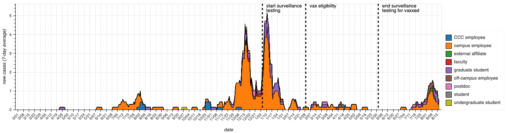
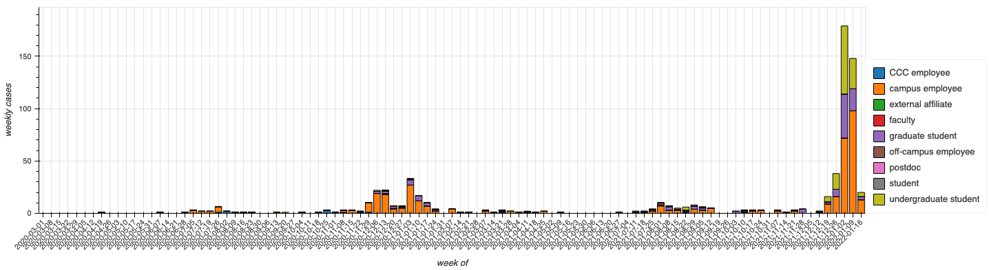

# caltech_covid19
Tracking cases in the Caltech community that have been reported to Caltech Student Wellness Services.

Data transcribed manually from: https://together.caltech.edu/cases-testing-and-tracing/case-log

Omitted cases where people lived out of state and had never accessed campus. Date indicates the date that a case was posted on the case log (not the date the people tested positive). CCC indicates Caltech Childcare Center.

## Last 15 weeks of data
Seven-day rolling average of cases:

Total cases each week:

## All data
Seven-day rolling average of cases:

Total cases each week:
