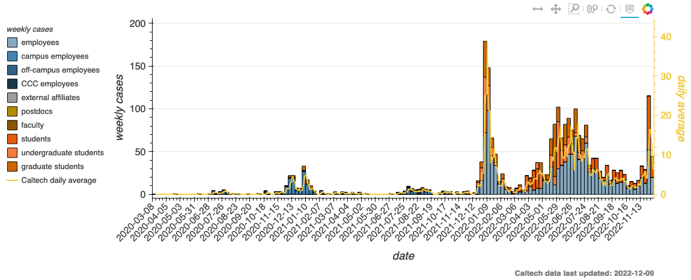
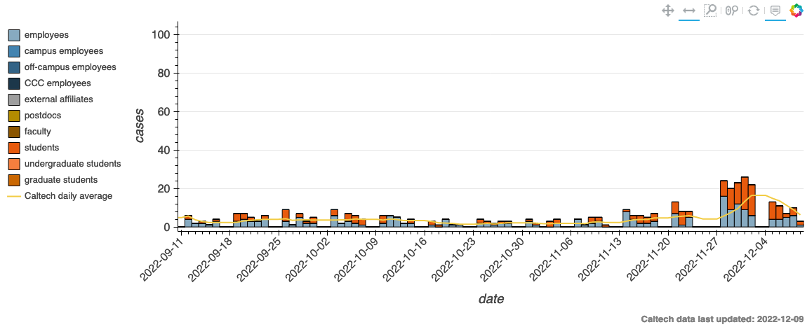

# caltech_covid19
Tracking cases in the Caltech community that have been reported to Caltech Student Wellness Services.

Data transcribed manually from: https://together.caltech.edu/cases-testing-and-tracing/case-log

Omitted cases where people lived out of state and had never accessed campus. Date indicates the date that a case was posted on the case log (not the date the people tested positive). CCC indicates Caltech Childcare Center.

Total Caltech cases each week with 7-day rolling average of Caltech and 7-day rolling average of LA County overlaid:

Daily Caltech cases in past 90 days with 7-day rolling average of Caltech and 7-day rolling average of LA County overlaid.
